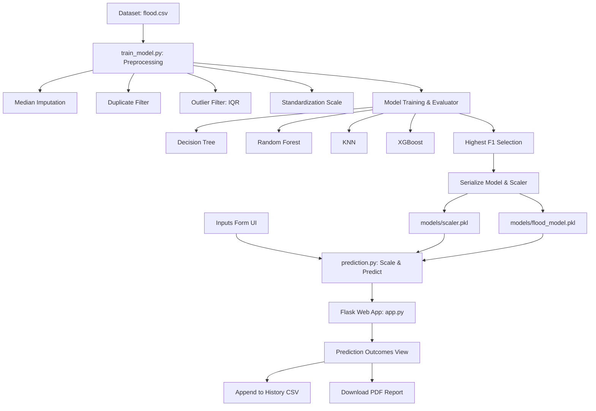

# Phase 3: Project Design Phase

This document presents the system architecture, component diagram, and data flows of the **Rising Waters** application.

---

## 1. System Architecture

The following block diagram represents the end-to-end data training and inference pipelines:

---

## 2. Component Design

### 1. Data Pipeline & Scale Normalization
Features are normalized using Scikit-Learn's `StandardScaler` to ensure distance-based models (KNN) and tree-based ensembles (Random Forest, XGBoost) receive features on similar numerical bounds. The fit scalar coordinates are exported alongside model weights to guarantee consistency during runtime.

### 2. Frontend Interface Design
Built using Bootstrap 5 grid layout tokens and customized variables defined in `style.css`. Incorporates:
- Form fields validation alerts.
- A loader spinner that locks form fields while running inference.
- An absolute client-side PDF document layout engine using the `jsPDF` library.
