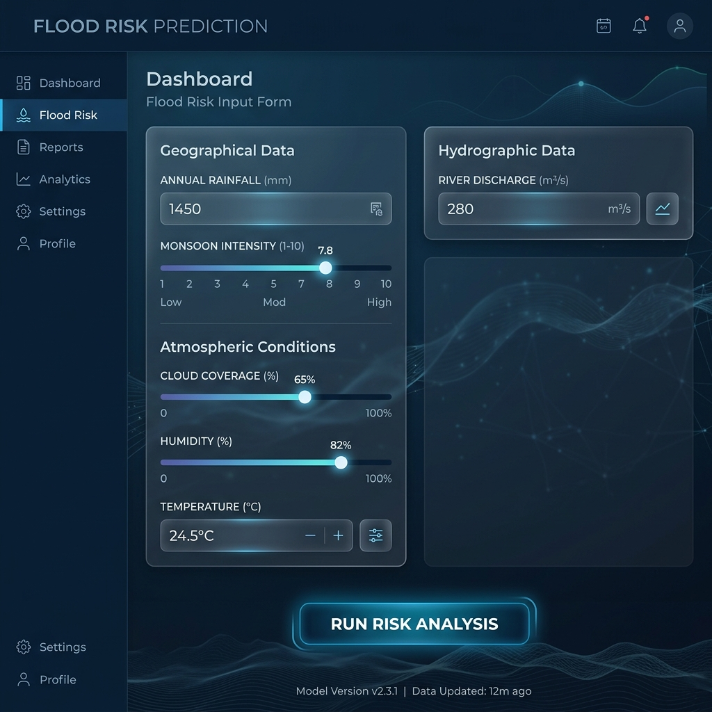

# Phase 8: Project Demonstration

This document provides visual presentation mockups and operational workflows demonstrating the **Rising Waters** application.

---

## 📸 User Interface Layouts

Here are the visual UI designs for the web application (saved under the [screenshots/](file:///c:/Users/satya/Downloads/flood_project/8.Project%20Demonstration/screenshots) folder):

### 1. Landing Page
Displays project abstract, system initialization status, and navigation menus.

### 2. Predict Risk Form
Allows inputting regional meteorological values. Validates entries and runs load overlays.

### 3. Risk Results Dashboard
Displays the risk status card (High/Low risk), probability, action plan, and PDF exporter.

---

## 📺 Demonstration Video & Deployment Details
- **Local Host URL**: [http://127.0.0.1:5000/](http://127.0.0.1:5000/)
- **Repository URL**: [https://github.com/ashraf-create/flood_project](https://github.com/ashraf-create/flood_project)
