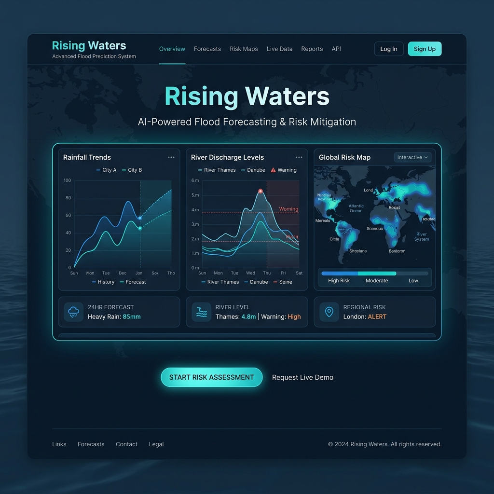
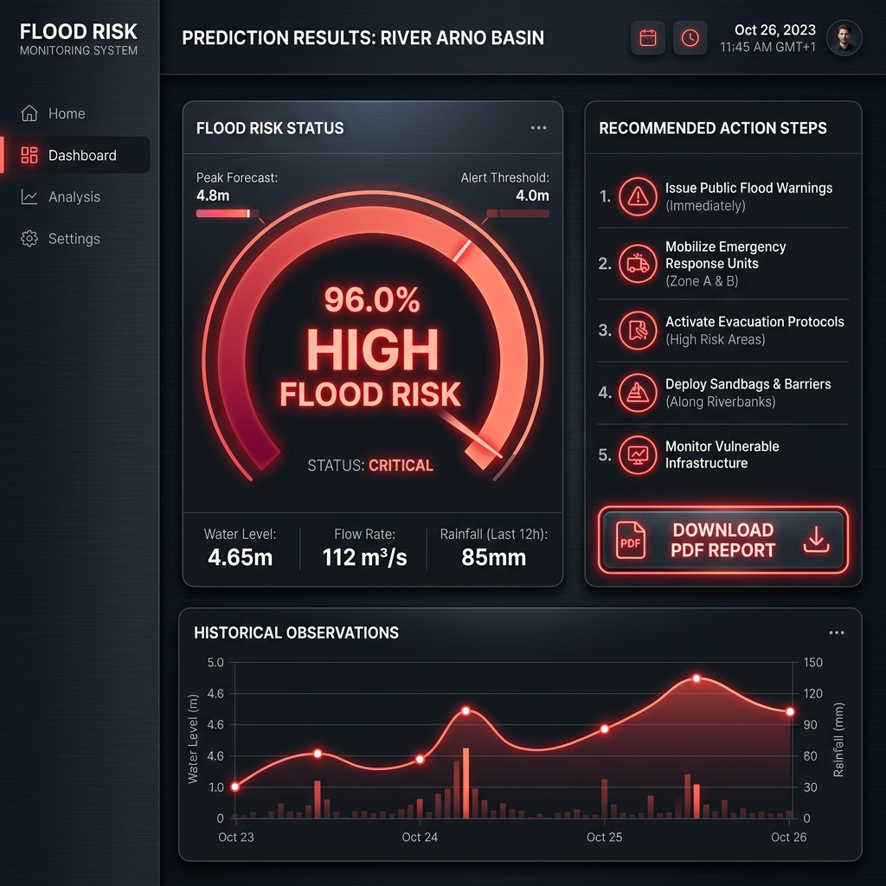

# Rising Waters: A Machine Learning Approach to Flood Prediction

An intelligent, end-to-end flood prediction system leveraging historical meteorological and hydrological observations to assess flood risk. 

---

## 📝 Abstract

Flooding is one of the most destructive natural disasters worldwide, causing extensive damage to infrastructure, loss of lives, and severe economic distress. Accurate and timely flood forecasting is critical for early warning systems and disaster management. 

This project implements an intelligent flood prediction system using classical and ensemble machine learning techniques. It trains and compares multiple classifiers—Decision Tree, Random Forest, K-Nearest Neighbors, and XGBoost—automatically serializing the model that achieves the highest F1-Score to handle class imbalances. The best-performing model is deployed via a responsive, premium Flask web interface, enabling users to input real-time weather indicators and receive instant risk probabilities, evacuation action plans, and downloadable PDF reports.

---

## ⚠️ Problem Statement

Traditional flood prediction methods often rely purely on complex physical modeling of river basins, which requires intense computational resources and localized geological telemetry. These approaches often fail to provide:
1. **Real-time Accessibility**: Allowing field officers, local administrators, and citizens to get instant risk evaluations.
2. **Multi-Classifier Comparisons**: Selecting the single best model based on regional dataset characteristics rather than relying on a static, pre-chosen model.
3. **Actionable Outcomes**: Generating immediate evacuation checklists and warning reports along with predictions.

Our solution addresses these gaps by building a web-accessible, machine learning-driven risk assessment dashboard that processes raw meteorological indicators into actionable safety warnings.

---

## 🌟 Features

- **Multi-Model Pipeline**: Auto-evaluates Decision Tree, Random Forest, KNN, and XGBoost.
- **Automated Serialization**: Selects and saves the model with the highest F1-Score (currently **XGBoost** with an F1-Score of **0.8892**).
- **Outlier Filtering & Preprocessing**: Integrates IQR-based outlier detection, duplicate removal, median imputation, and standard scaling.
- **Visual Analytics Dashboard**: Exports correlation heatmaps, class distributions, model comparison metrics, and confusion heatmaps directly to the interface.
- **Persistent Prediction Logs**: Saves prediction transactions to a local CSV database, accessible via a responsive history table.
- **Zero-Dependency PDF Exporter**: Instant, client-side A4 PDF report generator showing weather inputs and emergency steps.
- **Robust Exception Handling**: Graceful warning pages when weights are missing and complete client/server form validation.

---

## 🛠️ Tech Stack

- **Backend Logic**: Python 3.10, Flask
- **Machine Learning**: Scikit-Learn, XGBoost, Joblib
- **Data Engineering**: Pandas, Numpy
- **Visualizations**: Matplotlib, Seaborn
- **Frontend UI**: Bootstrap 5, FontAwesome, Vanilla CSS
- **PDF Compilation**: jsPDF

---

## 📁 Repository Structure

```
flood_project/
│
├── app.py                      # Flask Server (Routes, history logs, error pages)
├── train_model.py              # ML Training Pipeline (Preprocess, train, evaluate, plot)
├── prediction.py               # ML Inference Wrapper (Load model, scale inputs, predict)
├── requirements.txt            # Python Dependencies
├── runtime.txt                 # Target Python Version
├── Procfile                    # Web Process runner for Gunicorn
├── LICENSE                     # MIT License terms
├── .gitignore                  # Git untracked files
├── README.md                   # Main Project Documentation
│
├── dataset/
│   └── flood.csv               # Historical Meteorological Dataset
│
├── models/
│   ├── flood_model.pkl         # Best trained ML Model
│   └── scaler.pkl              # Fitted StandardScaler
│
├── docs/                       # Project Documentation Files
│   ├── system_architecture.md  # System layout and flows
│   ├── model_evaluation.md     # ML performance details
│   └── user_guide.md           # Operational guide
│
├── screenshots/                # Application mockups and visual guidelines
│   ├── landing_page.png
│   ├── predict_form.png
│   └── prediction_results.png
│
├── templates/                  # HTML Templates
│   ├── base.html               # Global UI navbar & footer wrapper
│   ├── index.html              # Landing Page
│   ├── predict.html            # Input Form
│   ├── result.html             # High/Low risk card and actions
│   ├── about.html              # Tech stack & Plot dashboard
│   ├── contact.html            # Contact mock page
│   ├── history.html            # CSV logged prediction logs
│   ├── 404.html                # Not Found Error Page
│   └── 500.html                # Server Error Page
│
└── static/                     # Frontend Static Assets
    ├── css/
    │   └── style.css           # Custom styles (Dark ocean-blue theme)
    └── js/
        └── script.js           # Client-side validation & jsPDF generator
```

---

## 🚀 Installation Steps

1. **Clone the Repository**:
   ```bash
   git clone https://github.com/ashraf-create/flood_project.git
   cd flood_project
   ```

2. **Initialize a Virtual Environment**:
   ```bash
   python -m venv venv
   # On Windows:
   .\venv\Scripts\activate
   # On macOS/Linux:
   source venv/bin/activate
   ```

3. **Install Dependencies**:
   ```bash
   pip install -r requirements.txt
   ```

---

## 💡 Usage Instructions

### 1. Train the Models
Ensure the training dataset [dataset/flood.csv](file:///c:/Users/satya/Downloads/flood_project/dataset/flood.csv) is present, and run:
```bash
python train_model.py
```
This trains the classifiers, serializes the best one to `models/`, and generates figures for the Dashboard.

### 2. Start the App
Run the Flask server:
```bash
python app.py
```
Open a browser and navigate to **[http://127.0.0.1:5000/](http://127.0.0.1:5000/)**.

---

## 📸 Screenshots

| View | Screenshot |
| :--- | :--- |
| **Landing Hero Page** |  |
| **Prediction Questionnaire** |  |
| **Risk Analysis Result** |  |

---

## 🔮 Future Scope

- **Real-Time API Integrations**: Integrate live weather web services (e.g., OpenWeatherMap API) to auto-fill current regional meteorological values.
- **Geographical GIS mapping**: Integrate interactive maps (e.g., LeafletJS or Mapbox) showing flood zones and dynamic risk coordinates.
- **SMS Warning Alerts**: Integrate Twilio API to send evacuation warning texts to residents in high-probability risk areas.

---

## 👥 Team Members

- **Syed Ashraf** - Lead Developer & ML Engineer ([GitHub Profile](https://github.com/ashraf-create))
- **[Intern Partner Name]** - Internship Coordinator / Co-Developer
- **[University/Organization Name]** - Internship Submission (July 2026)
