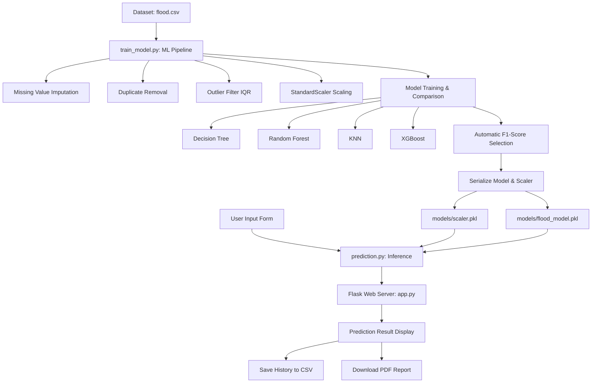

# System Architecture

The Rising Waters Flood Prediction System is designed with a production-ready, modular architecture. It links a machine learning training and inference backend with a responsive Flask-based web interface.

---

## Architecture Flow

The following details the sequential components of the system:

---

## Component Details

### 1. Data Preprocessing & Training Pipeline ([train_model.py](file:///c:/Users/satya/Downloads/flood_project/train_model.py))
- **Missing Value Handling**: Replaces missing variables with the median value of each column to ensure data robustness.
- **Duplicate Removal**: Identifies and drops identical records to prevent training bias.
- **Outlier Filtering**: Uses the Interquartile Range (IQR) method:
  $$\text{IQR} = Q3 - Q1$$
  Any sample falling outside $[Q1 - 1.5 \times \text{IQR}, Q3 + 1.5 \times \text{IQR}]$ is removed.
- **Standard Scaling**: Normalizes inputs using the `StandardScaler` to bring feature variances to equal scale.
- **Automated Serialization**: Compares evaluation metrics (Accuracy, Precision, Recall, F1-Score, ROC-AUC) across algorithms. The best model is automatically saved into the `models/` folder.

### 2. Inference Model Wrapper ([prediction.py](file:///c:/Users/satya/Downloads/flood_project/prediction.py))
- Exposes a unified API `predict_flood(input_data)` to process unscaled dictionary payloads.
- Dynamically loads `models/scaler.pkl` and `models/flood_model.pkl` to scale and evaluate new inputs.
- Handles exceptions gracefully, passing logs back to the server if files are not present.

### 3. Flask Server Application ([app.py](file:///c:/Users/satya/Downloads/flood_project/app.py))
- Coordinates routes (`/`, `/predict`, `/history`, `/about`, `/contact`).
- Operates a local CSV database logging engine, saving transaction timestamps, weather values, and calculated flood risk classifications.
- Provides static file access for dynamic charts generated during compilation.

### 4. Front-End Core
- **Structure**: Semantic HTML5 wrapping a Bootstrap 5 styled grid system.
- **Styling**: Ocean-blue styling token system defined in [static/css/style.css](file:///c:/Users/satya/Downloads/flood_project/static/css/style.css).
- **Interactions**: Pre-submission numerical validations and zero-dependency PDF compiler using `jsPDF` defined in [static/js/script.js](file:///c:/Users/satya/Downloads/flood_project/static/js/script.js).
